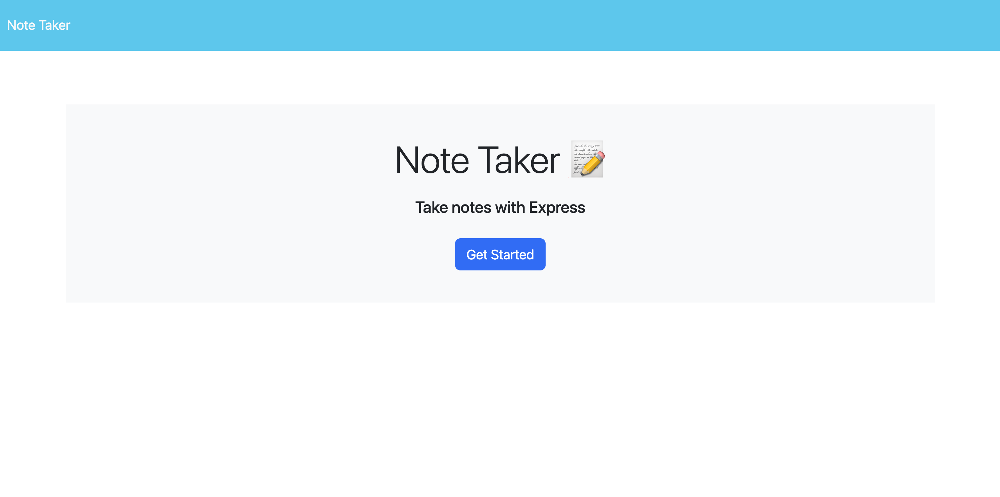
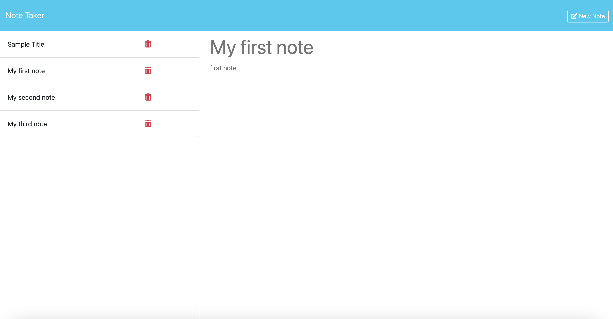

# Express Note Taker

## Repository

In this repository you will find the application code to an express note taker. The purpose of this application is to have the ability to save a note containing a title and text body. This application uses express to make GET, POST, and DELETE requests and requires path, fs, and uuid. Path is used to join given path segments together. The fs module allows the ability to read and write files in order to update the notes list. In the process of building the backend of this application I learned that it is extremely important to parse data and stringify when needed respectively in order to display information and update it. Code disection is something that helped me understand what needs to be done for proper functionality. Going back line by line through examples in the express module from the UT Full Stack Boot Camp and commenting lines out to see what happened if it's missing in the code is the best way to understand certain procedures. 

## Table of Contents

- [Contribute](#contribute)
- [Appearance](#appearance)
- [Usage](#usage)
- [Changes](#changes)
- [Features](#features)
- [Credits](#credits)
- [License](#license)

## Appearance

Landing Page:
    

Notes Page:
    

To view the deployed webpage click the following link: [Deployed Webpage]()

## Contribute

To view the repository of this application and contribute to this application click the following link:  [Express Note Taker](https://github.com/lmansilla92/express-note-taker)

If you need help on how to clone a GitHub repository into your local repository, visit the following GitHub link: [Cloning a repository](https://docs.github.com/en/repositories/creating-and-managing-repositories/cloning-a-repository) 

## Usage

- Click the "Get Started" button on the landing page
- Enter a note Title and Text
- Use the "Clear Form" button to clear input if needed
- Click the "Save Note" button to save the note
- New notes will be displayed on the left 
- Click the trash icon to delete any note

## Changes

I would like to make the following changes to this application:

- Add the ability to save notes within folders 
- Change the design and layout
- Add background to the note body section to resemble a lined note paper
- Add feature to include images in the notes body

## Features

Some of the features in this application include:

- Use of express to make GET, POST, DELETE requests
- Use of fs to retrieve and store data
- Use of uuid to generate a unique id for each note

## Credits

Starter Code Link: [https://github.com/coding-boot-camp/miniature-eureka]

## License

Link to [The MIT License (MIT)](https://github.com/lmansilla92/express-note-taker/blob/main/LICENSE)